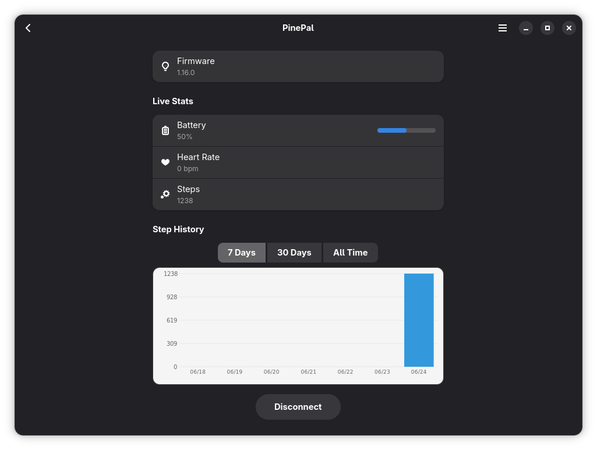
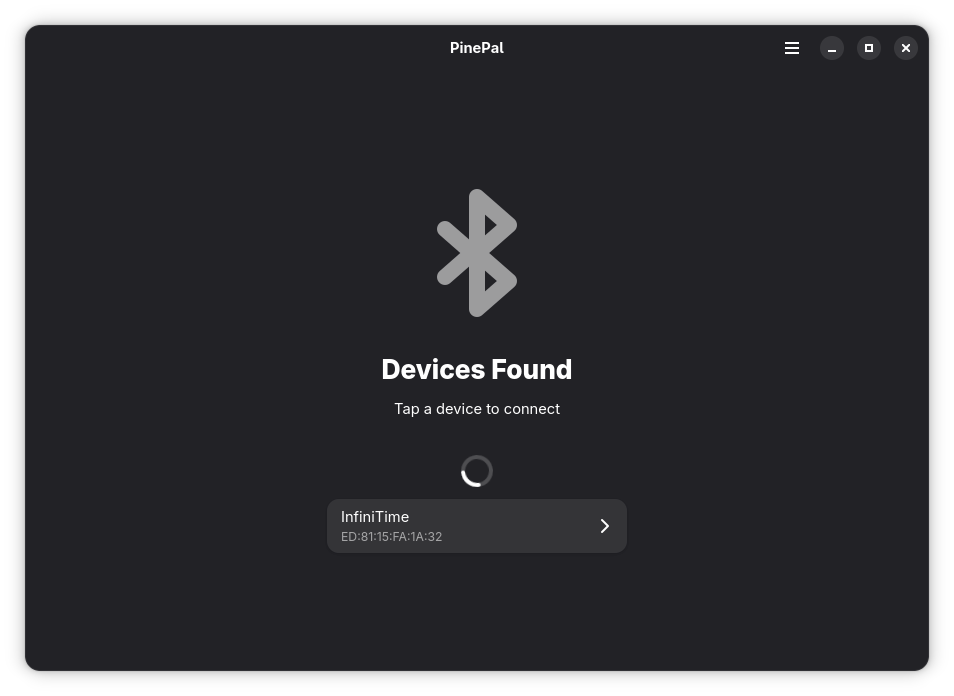
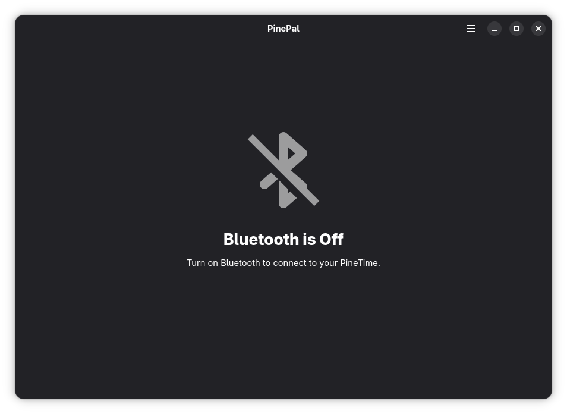
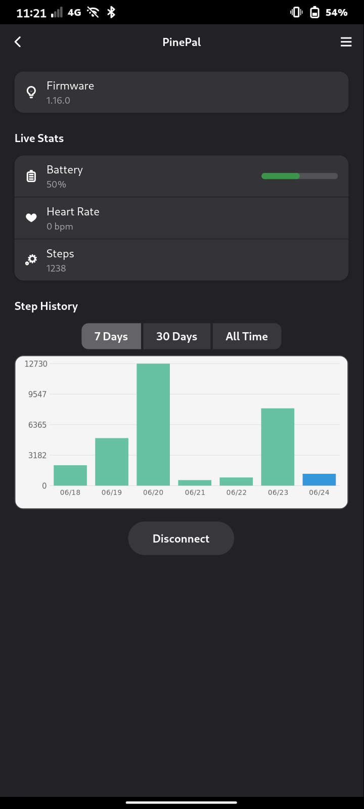

# PinePal

Companion app for [PineTime](https://www.pine64.org/pinetime/) smartwatches running [InfiniTime](https://github.com/InfiniTimeOrg/InfiniTime). Built with GTK4/libadwaita and Rust, aimed at mobile Linux devices such as the PinePhone or Furiphone.

## Features

- Secure BLE connection with automatic reconnection and exponential backoff
- Live battery, heart rate, and step count display
- Step history chart with daily persistence (7d / 30d / all time)
- Desktop notification and phone call forwarding to the watch
- Music/Media controls
- Pushing weather data to the watch
- Firmware can be directly fetched and updated within the app
- Background mode (keeps connection alive when window is closed)
- Said background mode can also be started manually by running flatpak run io.github.nico359.pinepal --gapplication-service
- Autostart via Background Portal - might not work in e.g. Phosh because the Portal is not implemented there yet

## To be improved

- Maybe also heart rate history with the new feature of InfiniTime 1.16
- Accepting or declining calls via ModemManager for non Halium devices
- Maybe support for other watches

## Screenshots

<div style="display: flex; flex-wrap: wrap; gap: 20px;">
  
  
  
  
</div>

## Credits

Based on the work of [Watchmate](https://github.com/azymohliad/watchmate) by Andrii Zymohliad.  
Also took some stuff from [Pinetime-Furios](https://github.com/jlclemmons/pinetime-furios) by Jeffrey Clemmons - mostly weather, secure pairing and phone calls.

## AI Disclosure

This application was built with the assistance of AI (GitHub Copilot CLI, Claude, DeepSeek, Kimi).

## Building

The easiest way to build the app is by using GNOME Builder IDE or flatpak-builder.

Example using flatpak-builder as a flatpak:
-  Install flatpak-builder
```
flatpak install org.flatpak.Builder
```

-  Compile the project into a local repo
```
flatpak run org.flatpak.Builder --repo=repo --force-clean --user build io.github.nico359.pinepal.json
```

-  Then create a bundle which you can install
```
flatpak build-bundle repo pinepal.flatpak io.github.nico359.pinepal
```
